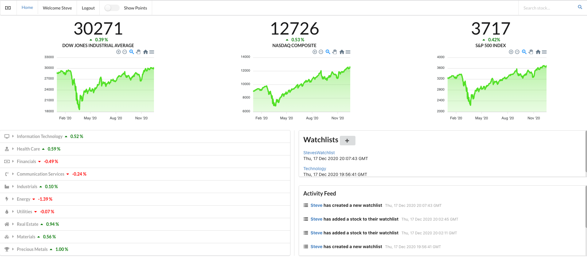

# Stock Market Tracker
https://stock-market-tracker-app.herokuapp.com/

# Technologies
## Front End
Javascript (React)
HTML, CSS
Libraries: Axios, ApexCharts, Semantic-ui-CSS, Semantic-ui-react

## Back End
Python (Flask)
Libraries: Flask, Peewee
Database: Postgres SQL

## Models
Tables/Relationship: User -> many watchlists -> many stocks, UserActivityLog

## Deployment CI/CD
Heroku

## API
TD Ameritrade Developer API

# User Stories 
## Basics
1. As a User, I want to be able to see the current most popular indexes and sectors on the home page
2. As a User, I want to be able to see charts for the major indexes
3. As a User, I want my data to be refreshed automatically 
4. As a User, I want to see colors based on the gains/losses for each item
5. As a User, I want to be able to toggle based on points or percent for gains/losses
6. As a User, I want to be able to expand and see details of each sector

## Login Authentication
7. As a User, I want to be able to register an account.
8. As a User, I want to be able to login with my account and see my username
9. As a User, I want to be able to logout from my account
 
## Features
10. As a User, I want to see updates in the Activity feed of users logging in, logging out and creating a new account
11. As a User, I want to see updates based on who created or added stocks to their wishlist
12. As a User, I want to be able to search an individual stock and see a chart as well as details for the stock
13. As a User, I want to be able to search additional stock from the same page and have it update
14. As a User, I want to be able to create a watchlist after registering/logging in

# Screenshot

# WireFrame
